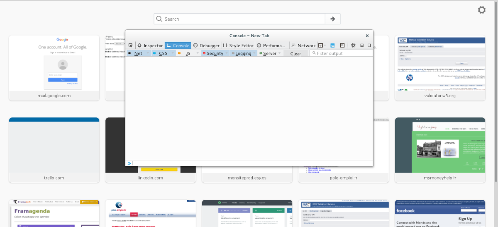

# Intéragir avec JavaScript

Jusqu'à maintenant tout ce que nous avons fait restait très théorique, nous n'avons pas programmé à proprement parler. Il est grand temps de commencer à intéragir avec JavaScript et d'écrire vos première lignes de code.

## 1\.Javascript et la console

**A\.Dans le navigateur**

Souvenez-vous, nous avions dit que JavaScript est un langage qui s'éxecute côté client, c'est donc votre navigateur web qui lit le code JavaScript et l'éxecute.

Cependant un petit problème se pose, vous voyez le HTML et le CSS à l'écran, vous savez donc quand quelque chose ne va pas mais qu'en est-il du JS ?

Pour voir l'execution de votre code JavaScript et repérer d'éventuels bug vous pouvez accéder à la **console de votre navigateur**. La console est comme une boîte de dialogue qui vous permet de voir le code JS en temps réel.

Sur Firefox :

- Cliquez sur le **menu** en haut à droite


- Choisissez **"developer"** (le symbole avec une clef plate)

- Choisissez **Web Console** et vous devriez normalement voir une petite fenêtre blanche apparaître. Voilà c'est la console où vous allez pouvoir taper vos premières lignes de JavaScript.



Pour tester la console rentrez simplement cette ligne de code, appuyez sur entrée et vous devriez voir quelque chose apparaître à l'écran :

```alert("Bienvenue dans le monde du JS");```

**B\.En ligne**

Je vous l'accorde, cette manière de faire n'est pas très pratique, on a peu de visibilité pour écrire. Heureusement des sites sont spécialisés dans la lecture de code JS en ligne. Je vous propose d'utiliser **JS Bin** mais il en existe d'autres.

Rendez-vous à cette adresse : https://jsbin.com/sifesixamu/edit?js,console

Vous verrez que vous avez une colonne sur la gauche dédiée à l'écriture de vos codes JavaScript et une colone sur la droite qui affiche la console.

Rentrez le même code que précédemment dans la colonne de gauche et cliquez sur le button "run" à droite, une fenêtre devrait alors apparaître.

## 2\.Les méthodes pour intéragir avec JavaScript

Javascript met à notre disposition 3 méthodes principales pour intéragir avec lui :

- **alert** : vous l'avez déjà rencontrée, elle permet de faire apparaître une boîte de dialogue à l'écran contenant un message (string, nombres...). Ce n'est qu'une fois que l'utilisateur a cliqué sur OK qu'il peut continuer.

La syntaxe est la suivante : ```alert(message à afficher);```

```alert(8);``` Affichera donc une boîte avec le chiffre 8.

Attention à bien respecter les notations, si votre message est un texte n'oubliez pas les guillemets.

- **prompt** : elle permet elle aussi de faire apparaître une boîte de dialogue à l'écran, mais cette fois avec une question à laquelle l'utilisateur peut répondre.

La syntaxe est la suivante : ```prompt(question à afficher);```

```prompt("Quel est votre nom ?");``` Affichera une boîte de dialogue demandant son nom à l'internaute.

Bon à savoir, les réponses de l'internaute sont **toujours retournées sous forme de chaîne de caractères**, cela peut vous jouer des tours quand vous demandez des nombres !

- **console.log** : elle permet d'afficher quelque chose dans la console, il n'y a donc pas de boîte de dialogue qui apparaît.

La syntaxe est la suivante : ```console.log(données à afficher);```

```console.log("test");``` Affichera test dans la console

## 3\.Commenter son code

Tout comme en HTML et en CSS, il est vital de commenter son code. Cela est d'autant plus vrai en JavaScript. Si vous ne commentez pas votre code vous serez très vite perdu quand celui-ci fera plusieurs centaines de lignes, il faut donc prendre l'habitude de le faire dès aujourd'hui.

- **Commentaire sur une ligne** :

```
//Votre commentaire

```

- **Commentaire sur plusieurs lignes** :

```
/* Votre commentaire

 sur plusieurs lignes */

```

## 4\.Sources

- http://www.w3schools.com/js/js_popup.asp

- https://developer.mozilla.org/fr/docs/Web/JavaScript/Reference/Commentaires
