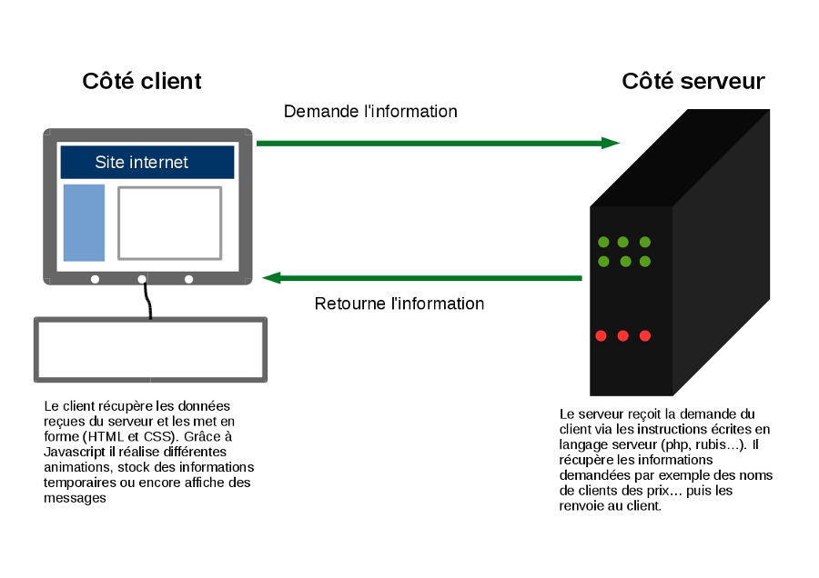
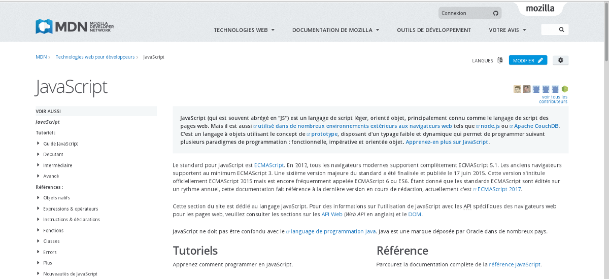
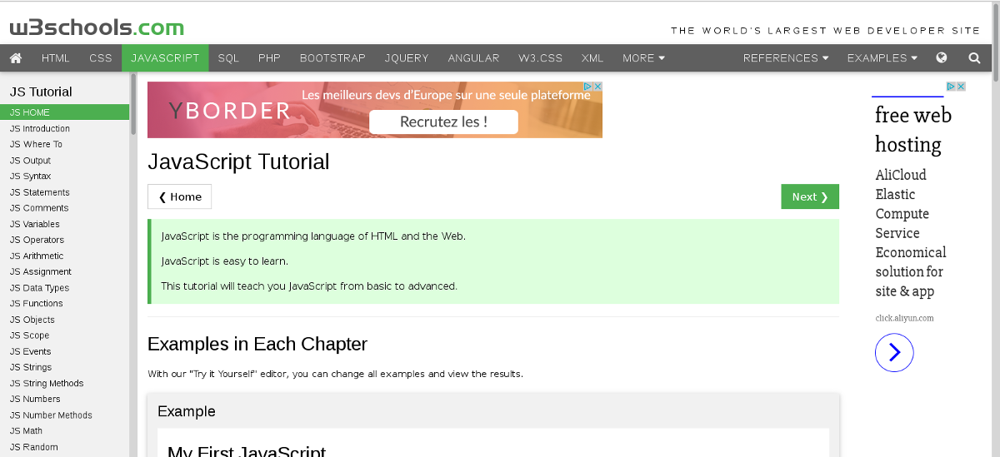

# Découvrir votre premier langage de programmation

Au cours de votre apprentissage qui vient seulement de débuter vous avez normalement été en contact avec deux des principaux langages du web à savoir HTML et CSS, aujourd'hui nous vous en présentons un troisième: le langage de programmation Javascript.

## 1\.Brève histoire du Javascript

Revenons rapidement sur la naissance de Javascript, savoir d'où le langage vient ne peut pas faire de mal.

Originellement il a été développé en 1995 par Brendan Eich pour le compte de la société Netscape (très importante société du secteur des télé-communications dans les années 90 et 2000) afin d'accompagner son navigateur web grand concurrent d'internet explorer à son époque.

Le langage Javascript connait un succès rapide lié à celui de Netscape qui pousse Microsoft à produire sa propre version et à l'implanter dans son navigateur. Dans la foulée Netscape soumet sa version à Ecma International (organisme de standardisation des langages informatiques) qui fixe les spécificités de Javascript et en fait la référence.

NB: Javascript bien que développé en s'inspirant de la syntaxe du langage Java n'a aucun rapport avec ce dernier dont les concepts fondamentaux sont bien différents.

## 2\.Javascript à quoi ça sert et comment ça marche ?

Avant toute chose vous devez savoir que Javascript, bien qu'extrêmement **puissant**, est un langage très **simple** à apprendre par rapport à d'autres.

Aujourd'hui vous pouvez utiliser Javascript pour :

- **Animer vos pages web** : il s'agit de l'usage historique de Javascript côté client. C'est lui par exemple qui permet de masquer un menu sur un site mobile, ou encore de faire apparaître des fenêtres sur votre écran quand vous cliquez sur un bouton et ce n'est là qu'un bref aperçu de tout ce que vous pouvez faire avec sur vos sites.

- **Développer des applications** : c'est un usage plus moderne de Javascript mais qui prend de l'ampleur. De nombreux développeurs ont souhaité aller plus loin avec ce langage simple et efficace. C'est ainsi que des projets comme Node.js ont vu le jour pour nous permettre de développer des applications/logiciels côté serveur.

Côté client, côté serveur, qu'est ce que ça veut dire tout ça ? Il est possible que vous soyez un peu perdu avec ces nouvelles expressions. Pour faire simple:

- **Côté client** c'est le côté de votre navigateur web, c'est ce que vous voyez s'afficher directement à l'écran.

- **Côté serveur** c'est toute la machine invisible qui s'occupe de traiter les données et de les envoyer à votre navigateur.

Si cela n'est pas clair ce petit schéma va vous aider :

## 3\.Documentation

Comme pour tout les langages il y aura plusieurs sites de documentation dont vous ne pourrez plus vous passer :

- **La documentation MDN sur Javascript** : https://developer.mozilla.org/fr/docs/Web/JavaScript

- **Le site de la w3school** : http://www.w3schools.com/js/default.asp . Bien qu'orienté tutoriel, il reprend tout ce qu'il y a à savoir sur Javascript

Sur ces sites, vous retrouverez toutes les spécificités et les fonctions du langage (nous verrons bientôt ce qu'est une fonction). Vous ne pourrez jamais toutes les retenir il est donc primordial de prendre l'habitude d'aller consulter la documentation.

## 4\.Sources

- https://developer.mozilla.org/fr/docs/Web/JavaScript

- http://www.w3schools.com/js/default.asp

- https://openclassrooms.com/courses/dynamisez-vos-sites-web-avec-javascript/introduction-au-javascript

- https://fr.wikipedia.org/wiki/JavaScript
