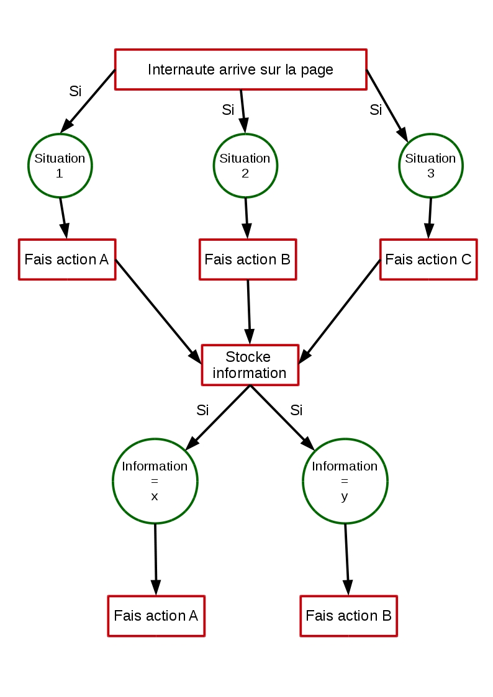

# Vous avez dit langage de programmation ?

Jusqu'à maintenant vous avez utilisé HTML et CSS mais ce ne sont pas des **langages de programmation**, plutôt des **langages de description** ou de mise en forme. Concrètement vous dites simplement à l'ordinateur affiches moi ceci maintenant et de telle manière.

## 1\. Qu'est ce que la programmation ?

Programmer c'est comme réaliser un film avec plusieurs scénarios possibles qui changent selon les choix du spectateur (cf les livres dont vous êtes le héros).

Tout le travaille du programmeur consiste, grâce au langage de programmation (pour nous ce sera JavaScript) à dire à l'ordinateur comment réagir dans tel ou tel cas de figure.

## 2\. La programmation au quotidien

Vous ne vous en rendez peut-être pas compte mais en réalité vous faites déjà de la programmation au quotidien et d'ailleurs vous connaissez aussi des programmes !

Admettons que vous vouliez vous faire un thé, qu'elles sont les actions que vous allez réaliser ?

- Vérifiez si vous avez du thé. Si vous n'en avez pas aller en acheter.

- Faire chauffer de l'eau

- Sortir une tasse en attendant

- Quand l'eau est chaude verser l'eau

- Mettre votre sachet de thé

- Laisser infuser

Toutes ceci n'est que votre programme ```faire du thé``` qui a été décomposé. Nous allons faire de même avec l'ordinateur : lui "apprendre" différentes actions pour réaliser un but.

## 3\. La programmation en JavaScript

En JavaScript justement nous allons pouvoir demander à l'ordinateur de réaliser des **actions complexes** selon des cas de figure précis.

Nous allons produire ce que l'on appelle des **algorithmes**, des suites d'instructions qui permettent de résoudre un problème.

Une instruction est un ordre que nous donnons à l'ordinateur pour qu'il réalise une action. En fait notre programme ```faire du thé``` est un algorithme.

Si tout cela ne vous semble pas très clair, regardez le schéma ci-dessous pour voir comment fonctionne un algorithme et ne vous inquiétez pas ces notions viendront avec le temps.


