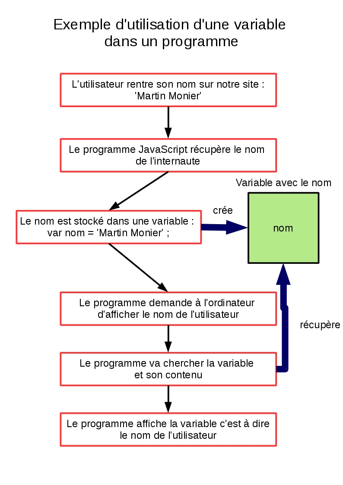

# Les variables en JavaScript

Jusqu'à maintenant nous avons parlé de données et de valeurs mais vous devez savoir que ces données ne se baladent pas comme ça dans la nature. En réalité vous travaillerez très rarement avec les données brutes. **La plupart du temps, vous travaillerez avec des variables qui contiendront vos données**.

## 1\.Le concept de variable

Reprenons encore une fois notre programme ```faire du thé```, vous n'allez pas en Chine chercher les feuilles de thé dont vous avez besoin pour les faire sécher, puis infuser ? Vous utilisez des sachets de thé qui s'occupent de **stocker** votre thé qui est déjà prêt à l'usage.

Les variables en programmation sont un peu comme vos sachets de thé ! Il faut les voir comme **des boîtes ou des sachets de rangement dans lesquels on peut stocker des données** pour que l'ordinateur puisse les réutiliser directement par la suite.

## 2\.Utiliser des variables en JavaScript

Concrètement comment ça s'utilise comment une variable en JavaScript ? Je ne vais pas vous faire patienter plus longtemps, voici une variable :

```
var exemple = "Un texte d'exemple";

```

Cela fait beaucoup de choses d'un coup alors reprenons la déclaration d'une variable étape par étape :

- 1) Le mot ```var``` indique à l'ordinateur que vous **déclarez une variable**. Chaque fois que vous déclarez une nouvelle variable vous devez commencer votre instruction par ```var```.

- 2) ```exemple``` : il s'agit du **nom de la variable**, quand nous voudrons nous en servir plus tard il faudra l'appeler par son nom sans guillemets.

- 3) ```=```  nous permet **d'assigner une valeur** à notre variable. Nous disons à l'ordinateur que ce qui suit après est le contenu de notre variable.

- 4) ```"Un texte d'exemple"````: il s'agit du **contenu de notre variable**, (les feuilles de thé), vous pouvez utiliser tous les types primitifs à disposition (ici du texte).

- 5) ```;``` : le point virgule est extrêmement important, il vient **finir votre instruction**. Il dit à l'ordinateur que la déclaration de variable s'arrête là. Ne l'oubliez surtout pas, c'est une des erreurs les plus communes des débutants.

Pour bien comprendre l'utilisation des variables regardez le schéma ci-dessous :



## 3\.Particularités des variables

**A\.Les variables ont plein de valeurs**

Nous l'avons déjà dit mais sachez que tous les types primitifs peuvent être stockés dans des variables. Ainsi nous pouvons avoir des variables de type:

- string: ```var name = "Martin Monier";```

- number: ```var age = 8;```

- boolean: ```var status = true;```

- nous reviendrons sur le type ```null``` et ```undefined``` dans un prochain chapitre.

**B\.Les variables sont variables...**

Les variables ne s'appellent pas variables pour rien, les valeurs qu'elles contiennent ne sont pas gravées dans le marbre, elles peuvent être **redéfinies** au cours de l'exécution de votre programme.

Dans l'exemple ci-dessous : la variable ```name``` aura pour valeur finale ```"Jeanne Moreau"``` et non ```"Martin Monier"```

```
var name = "Martin Monier";

name = "Jeanne Moreau";

```

Notez que lorsque je rappelle ma variable pour lui assigner une nouvelle valeur, je n'utilise pas le mot var. Je n'en ai pas besoin car elle a déjà été déclarée auparavant.

**C\.Quels noms pour nos variables ?**

 Vous ne pouvez pas et ne devez pas nommer vos variables n'importe comment, vous devez respecter quelques règles :

- **Donnez des noms compréhensibles à vos variables**. Evitez les ```var x``` ou ```var chose```. Le nom doit indiquer le contenu de la variable, en effet imaginez que vous ayez 100 variables avec des noms incompréhensibles, cela devient vite ingérable. Ainsi une variable qui stocke un nom utilisateur va par exemple s'appeler ```userName```.

- **Ne pas utiliser de mots réservés**. Il existe un vocabulaire propre à JavaScript, le mot ```var``` en fait partie par exemple. Tous ces mots utilisés par JavaScript sont réservés et ne peuvent être utilisés comme noms de variables au risque de créer un bug. Je vous invite à consulter la liste complète : https://developer.mozilla.org/fr/docs/Web/JavaScript/Reference/Mots_r%C3%A9serv%C3%A9s

- Il faut également **respecter un certaine typographie** dans vos noms pour qu'ils soient facilement lisibles. Souvenez-vous nous avions écrit ```userName``` avec un N. Cela s'appelle le **camel case**, cette convention consiste à mettre une majuscule aux noms liés pour les identifier plus facilement.

- JavaScript est **sensible à la casse**, autrement-dit il fait la différence entre majuscules et minuscules. ```user``` et ```User``` sont donc deux noms de variables différents.

## 4.Sources

- http://www.w3schools.com/js/js_variables.asp

- http://www.commentcamarche.net/contents/588-javascript-les-variables
