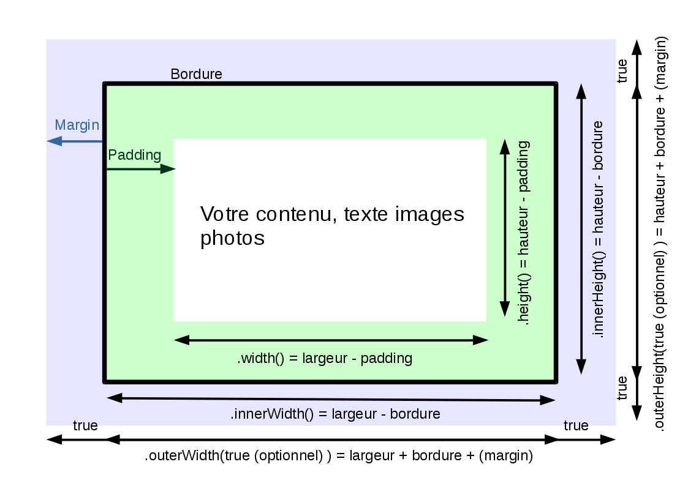

# Gérer les dimensions de ses éléments HTML avec jQuery

Pour ce dernier chapitre de notre introduction à jQuery nous allons nous attaquer à un gros ensemble de fonctions. Au premier abord elles vous sembleront peut-être compliquées mais pas de panique, nous allons y aller étape par étape.

Il vous arrive fréquemment de modifier les dimensions de vos éléments via le CSS, jQuery permet de récupérer ces dimensions mais aussi de les modifier. Pourquoi utiliser jQuery et pas CSS me direz-vous ? Parce qu'**il peut-être intéressant de les modifier dynamiquement et parce que jQuery est beaucoup plus précis dans les mesures** qu'il peut nous retourner. Pour preuve voyez ce schéma (encore une fois pas de panique).



Reprenons chaque mesure sur l'image de l'intérieur vers l'extérieur et expliquons-les.

## 1\. Largeur et hauteur absolue

Il s'agit des dimensions de notre élément **sans tenir compte de son padding, son margin ou la taille de sa bordure**. Il s'agit en fait de l'espace restant quand vous souhaitez écrire du texte ou insérer une photo.

Cela correspond aux méthode ```.width()``` et ```.height()```. En utilisant ces méthodes **sans arguments**, elles vous retournerons les dimensions de l'élément sélectionné. Si vous **passez un argument** vous pourrez modifier les dimensions de l'élément en question. Les arguments peuvent être de deux types:

- **numérique (integer)** : jQuery partira du principe que vous indiquez une dimension en pixels.

- **sémantique (string)** : vous donnez votre valeur sous forme de string et spécifiez son unité, cependant sachez que les unités relatives seront interprétées en pixels. Dans la pratique vous utiliserez donc plus souvent les integer.

Tout cela reste peut-être encore un peu flou, prenons un exemple pour être sûr de bien comprendre. Voici un élément de classe "test" avec les dimensions suivantes :

```
.test {
  width: 500px;
  height: 300px;
  margin: 50px;
  padding: 50px;
  border: 5px solid black;
}

```

A votre avis qu'elle va être la valeur de la variable ```var size``` avec l'instruction suivante ?

```
var size = $(".test").width();

```

Elle vaudra 390. Soit largeur de base - bordure gauche - bordure droite - padding gauche - padding droit soit 500 - 5 - 5 - 50 - 50. Sur le même principe avec ```.height()``` la variable vaudrait 190 (300 - 5 - 5 - 50 - 50).

Si vous utilisez ces méthodes pour modifier des dimensions **n'oubliez pas de prendre en compte ces éléments**. Ainsi avec l'instruction suivante mon élément de classe "test" fera en réalité 600px de large car je dois lui rajouter les paddings et bordures.

```
$(".test").width(490);

```

## 2\. Largeur et hauteur interne

Ces valeurs correspondent aux méthodes ```.innerWidth()``` et ```.innerHeight()```. Elles fonctionnent sur le même principe que les précédentes si ce n'est qu'**elles incluent le padding de l'élément dans leur calcul**.

Ainsi dans notre exemple, quelle serait la valeur de ```var size``` avec l'instruction suivante ?

```
var size = $(".test").innerWidth();

```
Celle-ci vaudrait 490, soit largeur de base - bordure gauche - bordure droite, soit 500 - 5 - 5 .

Si vous souhaitez assigner une valeur n'oubliez pas de **prendre en compte la bordure**, ainsi avec l'instruction suivante, mon élément fera en réalité 610px de large avec sa bordure :

```
$(".test").innerWidth(600);

```

## 3\. Largeur et hauteur externe

Ces valeurs correspondent aux méthodes  ```.outerWidth()``` et ```.outerHeight()```. Elles fonctionnent sur un principe quelque peu différent des précédentes. Dans leur état le plus simple, **sans argument, elles incluent les bordures** dans la taille de l'élément. Si on leur **passe le boolean ```true``` en argument alors elles incluent les margins** dans leur calcul.

Concrétement, sans argument ces méthodes vous renvoient la taille spécifiée dans les propriétés ```width``` et ```height``` de l'objet. Avec argument elles ajoutent les margins.

Ainsi avec l'instruction suivante, ```var size``` vaut 500 :

```
var size = $(".test").outerWidth();

```

Avec son argument, elle vaut 600 :

```
  var size = $(".test").outerWidth(true);

```

Vous pouvez utiliser ces méthodes sans argument pour assigner une dimension. Ainsi avec l'instruction suivante, notre élément fera 700px de large bordures incluses.

```
$(".test").outerWidth(700);

```
**Attention vous ne pouvez pas assigner de dimensions en incluant les margins.**

## 4\. Sources

- http://www.w3schools.com/jquery/jquery_dimensions.asp
