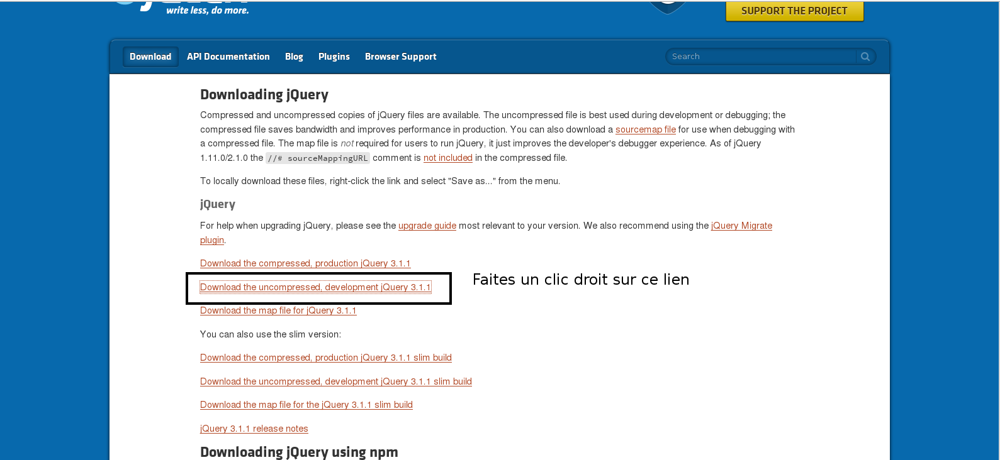
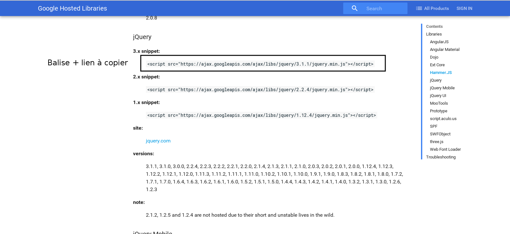

# Intégrer la bibliothèque jquery à son projet

Nous l'avions dit en introduction, jquery étant une bibliothèque, elle vient se greffer sur un projet existant. Mais concrétement quelle forme a jQuery ? Il s'agit en fait tout simplement d'un **fichier jquery.js** qui contient un très grand nombre de fonctions que l'on pourra réutiliser. Il faut donc appeler ce fichier dans nos pages comme l'on appelle nos scripts Javascript.

Deux méthodes s'offrent à nous, chacune avec ses avantages.

## 1\.Télécharger jquery en local

Il s'agit de **la méthode la plus longue**, elle consiste à télécharger le fichier jQuery et à l'installer sur votre ordinateur afin que celui-ci soit **toujours disponible même en mode off-line**. Pour ce faire vous pouvez télécharger le fichier sur le site officiel de jQuery, rubrique download (http://jquery.com/download/).

Comme vous le voyez, plusieurs liens nous sont proposés :

- compressé/production (jquery.min.js) : il s'agit de la version finale à utiliser sur un site en ligne. Cette version est plus légère, elle ne contient aucun commentaire, espace ou retour à la ligne. Elle est donc plus rapide à charger.

- décompressé/développement (extension jquery.js) : il s'agit de la version à utiliser lorsque vous travaillez sur votre site en local. Le code est indenté, commenté et compréhensible mais plus long à charger.

Nous allons utiliser la **version décompréssée**. Vous pouvez la télécharger en faisant un clic droit et en choisissant "save link as" puis en précisant le dossier  "js" de votre projet.



Maintenant que jQuery est inclus dans votre projet, il suffit de l'appeler dans vos page. La bonne pratique consiste, tout comme pour le Javascript à le mettre **avant la fermeture de votre balise ``` <body> ```**. Ainsi votre code jQuery charge après les éléments HTML avec lesquels il travaille.

Faites tout simplement appel à votre jQuery avec une **balise script** comme pour n'importe quel fichier Javascript.

```
Votre code HTML

        <script src="js/jquery.js"></script>
    </body>
</html>

```

## 2\.Utiliser un CDN

Voilà la deuxième méthode, la **plus facile et la plus rapide**. Vous devez tout d'abord vous demandez ce qu'est un CDN (Content Delivery Network). Pour faire simple il s'agit d'un serveur qui met gratuitement du contenu à disposition du public.

Au lieu de télécharger le fichier jQuery on peut donc simplement **inclure un lien vers celui-ci sur le CDN**.

Plusieurs CDN sont à votre disposition : jQuery, Google et Microsoft. Nous utiliserons le CDN Google. Vous pouvez trouver les liens des librairies hébergées par Google à cette adresse : https://developers.google.com/speed/libraries/.

Rendez-vous dans la section jQuery et copiez le lien de la version voulue (nous prendrons la 3.1) avec sa balise script.



Ensuite il vous suffit d'intégrer cette balise script juste avant la fermeture de votre balise ``` <body> ```.

```
       <script src="https://ajax.googleapis.com/ajax/libs/jquery/3.1.1/jquery.min.js"></script>
    </body>
</html>
```
L'inconvénient avec l'usage d'un CDN est que **si le serveur rencontre un problème, votre code jQuery risque de ne plus fonctionner**.

L'avantage par contre est que vos visiteurs ont probablement déjà visité des sites utilisant un CDN jQuery et ont le code enregistré en cache ce qui **améliore considérablement le temps de chargement de votre site**.

## 3\.Sources

- https://openclassrooms.com/courses/simplifiez-vos-developpements-javascript-avec-jquery/avant-de-commencer-6
