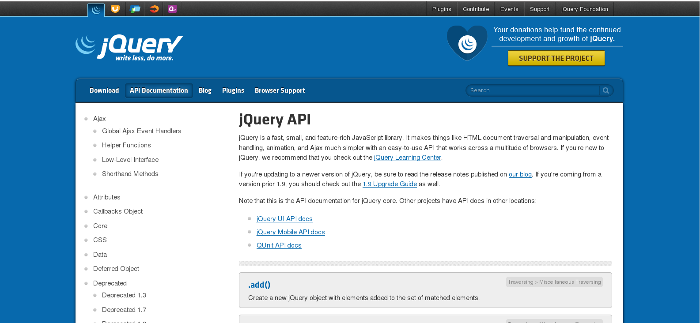
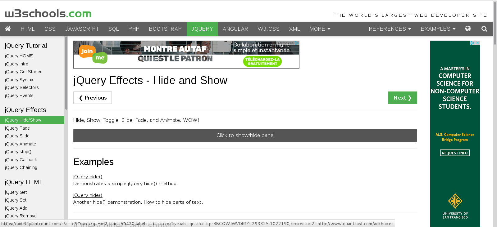

# JQuery en quelques mots

Cela fait maintenant plusieurs semaines que vous faites du Javascript et vous devez commencer à vous sentir à l'aise avec son usage et vous avez normalement animé vos premières pages en vous lançant dans le DOM.

Comme on ne perd jamais de temps, il maintenant l'heure de s'attaquer à un autre incontournable du web, j'ai nommé jQuery. Enfin pas de panique, vous verrez que jQuery et Javascript sont étroitement liés.

## 1\.Qu'est ce que c'est ?

JQuery est une **bibliothèque Javascript** créée en 2006 par John Reisig, soit plus de 10 ans après la création de Javascript, HTML et CSS. Il faut se rappeler qu'à cette époque Javascript, aujourd'hui supporté par tous les navigateurs n'étaient pas traité de la même manière par tous. Il fallait donc adapter son code aux navigateurs.

En arrivant sur le marché jQuery a réglé le problème en prenant en charge les tests liés à la compatibilité sur les différents navigateurs, d'où l'une des raisons de son succès.

JQuery est une bibliothèque c'est à dire un **ensemble de méthodes qui viennent se greffer à un programme existant** développé par vos soins. Nous viendrons donc simplement intégrer la librairie jQuery à nos projets existants.

## 2\.Que fait-il et pourquoi l'utiliser ?

Concrètement jQuery nous donne accès à un ensemble de fonctions prédéfinies (les méthodes) qui nous permettent de **simplifier nos développement Javascript**.

 Vous l'avez sûrement remarqué la syntaxe en Javascript peut-être complexe et la moindre erreur aura tendance à bloquer l'exécution du script au complet. Le risque de faire des erreurs est d'autant plus grand qu'il faut souvent plusieurs instructions Javascript pour arriver au résultat escompté.

JQuery a donc compilé les instructions JS des actions les plus communes dans **des fonctions beaucoup plus simples à réutiliser**.

JQuery vous permet de faire ce que vous faisiez déjà en JS :

- **modifier le HTML**

- **modifier le CSS**

- **traverser le DOM**

- **animer vos pages**

- **travailler avec l'AJAX**

Au final vous faîtes la même chose qu'en Javascript mais le **code est plus intuitif** à écrire et surtout **vous en écrivez beaucoup moins** ! Le slogan de jQuery prend tout son sens.

## 3\.Documentation

Comme pour les autres langages la documentation est essentielle et vous ne pourrez pas passer à côté. JQuery vous offre tellement de méthodes et de manières de les utiliser qu'il serait impossible de toutes les retenir.

Dès que vous avez une question ou une erreur dans votre code, votre premier réflexe doit être d'aller consulter la documentation. En tant que développeur jQuery vos sources seront principalement :

- **le site officiel de jQuery** et la documentation de l'api à cette adresse : http://api.jquery.com/. Vous y trouverez dans la colonne de gauche un glossaire qui reprend l'ensemble des méthodes jQuery disponibles avec l'explication de leur fonctionnement et des exemples.

- le **tutoriel jQuery de w3schools** qui revient de manière claire et concise sur l'ensemble des méthodes jQuery que vous devez connaître.

## 4\.Sources

- https://openclassrooms.com/courses/simplifiez-vos-developpements-javascript-avec-jquery/avant-de-commencer-6

- http://www.w3schools.com/jquery/jquery_intro.asp
