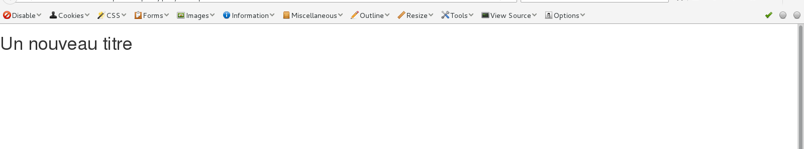

# Ecrire des instructions en jQuery

Dans ce chapitre nous allons voir ensemble comment écrire vos premières instructions jQuery. Au début la syntaxe jQuery sera probablement déconcertante comparée à Javascript mais pas de panique vous serez très vite à l'aise.

## 1\.Syntaxe détaillée

Prenons une page HTML et appliquons y une instruction basique en jQuery

index.html

```
<h1>Titre de premier niveau</h1>

```
main.js

```
  $("h1").html("Un nouveau titre");

```
Voilà l'occasion de voir si vous avez bien inclus jQuery dans votre projet au chapitre précédent en copiant ces deux bouts de code dans les fichiers correspondants.

Si tout fonctionne correctement vous devriez voir apparaître à l'écran un titre avec pour contenu "Un nouveau titre" et non "Titre de premier niveau". C'est normal, en fait **nous venons d'écrire une instruction jQuery qui permet de modifier le contenu d'une balise HTML**.



Regardons cette instruction de plus prêt, elle contient en fait **4 parties distinctes** :

- **le signe $**: il précède chacune de nos instructions et permet d'instancier jQuery. Sans lui le navigateur ne saura pas que vous utilisez jQuery et votre code ne fonctionnera pas.

- **le sélecteur ("h1")** : le sélecteur, comme en CSS détermine l'élément HTML à cibler, il est toujours entre parenthèses et entre guillemets

- **la function .html("Un nouveau titre")** : il s'agit d'une function ou méthode disponible en jQuery qui permet de modifier le contenu de l'élément HTML ciblé. Elle prend une string en argument.

- **le ;** : comme en Javascript il indique à l'ordinateur que l'instruction est finie

Pour comparaison voilà ce à quoi ressemblerait le même code en Javascript pur, je suis sûr que vous commencez déjà à aimer jQuery :

```
document.getElementsByTagName("h1")[0].innerHTML = "Un autre titre";

```

## 2\.Une bonne pratique

Avant de continuer nos développement jQuery, revenons rapidement sur une **bonne habitude à prendre**. Le code jQuery précédent aurait normalement dû être celui-ci :

```
$( document ).ready(function() {
  $("h1").html("Un nouveau titre");
});

```
Nous avons inclus notre instruction dans ``` $(document).ready(function(){ });``` . Il s'agit d'une méthode jQuery qui permet d'**attendre que tout le DOM soit chargé** avant de lire le code. Prenez pour habitude de démarrez vos fichers avec cette fonction et d'inclure tout votre code à l'intérieur. Cela évitera les bugs liés au chargement de la page.

## 3\.Sources

- http://www.w3schools.com/jquery/jquery_syntax.asp

- https://openclassrooms.com/courses/simplifiez-vos-developpements-javascript-avec-jquery/premiers-pas-7
