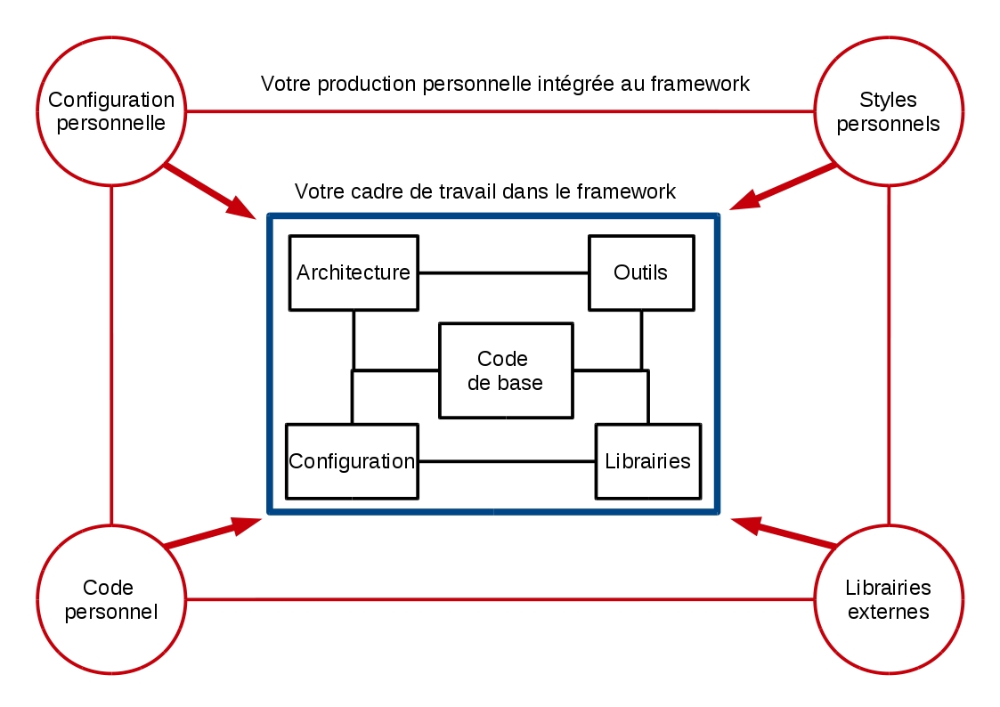

# Vous avez dit framework ?

Avant de commencer à rentrer dans le vif du sujet et développer sous Bootstrap, il faut revenir sur un concept avec lequel vous n'êtes pas forcément familier : le framework.

## 1\. Qu'est ce qu'un framework ?

Peu importe votre langage ou même la nature de votre projet, il y aura toujours des morceaux de code que vous devrez réécrire car ils constituent la base de toute application.

Certains développeurs se sont donc mis en commun pour proposer des outils gratuits qui vont vous éviter de devoir répéter les mêmes actions pour vous concentrer sur ce qui est vraiment important.

Un framework est un cadre de travail, un dossier vous fournissant la base de votre projet (cf boilerplate), au sein duquel vous allez travailler avec des outils pré-configurés pour produire plus rapidement un code de qualité.

Aujourd'hui, les développeurs qui codent tout à la main sont devenus rares car il est très compliqué d'assurer une qualité constante sur toutes les technologies d'un projet. La plupart du temps vous utiliserez donc un, voire plusieurs, frameworks.

On trouve des frameworks pour beaucoup de technologies différentes :
- PHP (Symfony, Laravel...)
- Python (Django)
- CSS (Bootstrap, Materialize...)
- JavaScript (Angular, Vue...)
- Et plein d'autres...

## 2\. A quoi ça sert ?

Vous avez peut-être du mal à réaliser à quoi ressemble un framework. En fait selon la technologie concernée, les outils qui vous sont fournis seront différents, on peut trouver par exemple :

- Une architecture avec tous les dossiers et l'organisation de votre application, c'est souvent le cas pour les frameworks back-end (cf Symfony)

- Des fichiers de configurations permettant de travailler sur une base uniformisée (par exemple entre différents navigateurs)

- Des outils pour l'automatisation de certaines tâches

- Les librairies les plus utilisées

- Des morceaux de code pré-écrits vous fournissant les lignes essentielles à tout projet

Vous vous en doutez, la présence de ces outils va vous apporter des avantages non-négligeables :     

- Gain de temps, vous évitez de refaire toujours les mêmes actions et mêmes paramétrages

- Assurance d'avoir une architecture propre

- Respect des bonnes pratiques

- Paramètres les plus courants déjà appliqués

## 3\. Et Bootstrap dans  tout ça ?

Si vous avez suivi avec assiduité notre parcours HTML et CSS, vous vous êtes sûrement rendu compte que bien souvent vous réécrivez le même code.

Marre de toujours commencer vos pages avec un header qui fait 100% de la page en largeur et avec du texte aligné au centre ? Marre de toujours devoir refaire le même positionnement sur les pages ? Alors Bootsrap est fait pour vous !

Bootstrap est en fait une introduction en douceur aux frameworks, puisqu'il s'agit d'un framework front (CSS, plus un peu d'HTML et de JavaScript) sa structure est donc assez légère et facile à appréhender.

Grâce à lui, vous allez disposer de morceaux de pages déjà écrits, avec différents styles à disposition que vous n'aurez qu'à copier. Libre ensuite à vous de personnaliser cette base.

## 4\. Pour récapituler

## 5\. Sources

- https://fr.wikipedia.org/wiki/Framework

- https://openclassrooms.com/courses/prenez-en-main-bootstrap/mise-en-route-8
