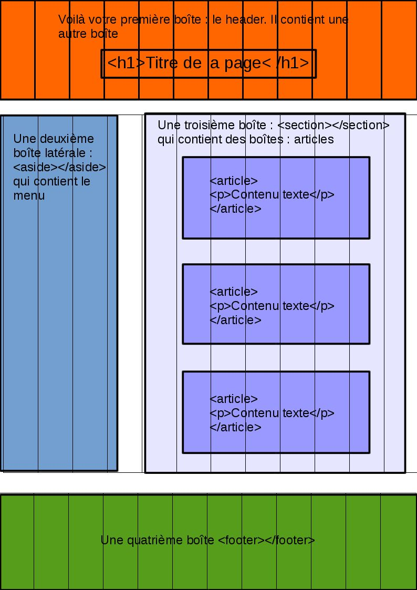

# Positionner ses éléments grâce à la grille Bootstrap

Le positionnement est un chapitre important pour tout développeur web, jusqu'à maintenant vous avez utilisé différentes techniques pour le gérer en CSS. Normalement, vous en avez principalement utilisé deux :

- La propriété ```display``` pour changer la nature des éléments et notamment la valeur ```inline-block```

- Flexbox et toutes les valeurs associées

Si vous en avez marre de toujours devoir gérer la position de vos éléments au cheveux prêt sans être sûr que leur position sera exactement la même sur tous les navigateurs et tous les appareils, Bootstrap vous propose une solution : **un système de grille** !

## 1\.Une grille, mais quelle grille ?

En fait Bootstrap part du principe que chaque espace sur un site internet peut être divisé en **12 cellule de tailles égales** et qu'en déterminant le nombre de cellules qu'occupent nos éléments nous pouvons les positionner où bon nous semble.

Cela ne vous semble pas clair ? Regardez le schéma suivant représentant le positionnement classique d'un site internet. Nous avons superposé un tableau de **douze colonnes** sur les éléments principaux.

Grâce à Bootstrap vous pourrez facilement gérer votre positionnement en déterminant simplement le **nombre de colonne que vos éléments doivent occuper** en largeur.

Sachez aussi que :

- **La hauteur des colonnes est déterminées par la hauteur du contenu**, on les utilise donc surtout pour gérer la largeur des éléments

- Vous pouvez gérer le nombre de colonnes qu'occupe un élément pour toutes les tailles d'écrans supportées par Bootstrap, **le responsive est donc beaucoup plus simple**

- **Chaque élément peut-être divisé** en une grille de 12 colonnes, dans notre schéma les articles peuvent par exemple à leur tour être divisés en 12 cellules pour gérer la position des éléments qu'ils contiennent.




## 2\.Gérer la positions des éléments sur la grille

C'est bien beau tout ça mais vous devez vous demander comment utiliser cette grille non ? Pour vous expliquer le système de grille, nous allons réaliser un exemple classique à savoir, trois articles centrés sur une page comme on en voit sur de nombreux blogs.


### A\.Définissez un container

C'est la première étape, **vous ne pouvez utiliser le système de grille qu'au sein d'un d'un container**, pour cela il faut choisir un élément HTML sur votre page et lui ajouter la classe ```container``` ou ```container-fluid```.

La différence entre les deux est qu'un container simple n'occupera pas tout l'espace de son parent, il aura une marge à gauche et à droite et sera centré. Un container-fluid lui occupera par contre tout l'espace de son parent.

Commençons donc par créer notre container au sein duquel nous allons travailler :

```
<div class="container">
</div>

```

### B\.Définissez une rangée

La rangée ou row en anglais est **l’élément qui va contenir nos 12 cellules**, n'importe quel élément peut importe sa taille peut faire office de rangée. Pour cela il suffit de lui ajouter la classe ```row```.

Dans notre exemple, nos articles vont être rangés dans une section, il vont chacun occuper un certain espace de cette section, c'est donc elle qui fera office de rangée :

```
<div class="container">
  <section class="row">
  <!-- nous avons maintenant accès à douze cellules -->
  </section>
</div>

```

### C\.Définissez vos colonnes

Il faut maintenant définir le **nombre de colonnes que chaque élément va occuper** dans le tableau, pour cela, il faut ajouter la classe ```col-nombre de colonnes``` à un élément HTML qui contiendra nos articles.

Vous devez simplement vous assurer que le total des colonnes occupées par vos éléments ne dépasse pas 12 à moins que vous ne souhaitiez faire passer un élément à la ligne !

Dans notre exemple, nous voulons que nos articles fassent la même taille et occupent tout l'espace, nous allons donc les mettre dans une div avec la classe ```col-4``` :


```
<div class="container">
  <section class="row">
     <div class="col-4">
            <article>
              <h2>test</h2>
            </article>
       </div>
       <div class="col-4">
            <article>
              <h2>test</h2>
            </article>
       </div>
       <div class="col-4">
            <article>
              <h2>test</h2>
            </article>
        </div>
  </section>
</div>

```
Remarquez comme vos div possèdent déjà un léger padding ce qui fait que vous obtenez des articles parfaitement positionné et aérés.

Voilà vous venez de réaliser votre premier positionnement sur la grille Bootstrap, **vous pouvez maintenant faire tout votre site de cette manière** !

## 3\.Allons plus loin

Nous allons le voir, il y a encore beaucoup de choses à faire avec le système de grille offert par Bootstrap

### A\.Un design responsive

Si dans votre navigateur, vous passez votre page en version smartphone vous verrez que nos articles occupent toujours 4 colonnes, ce qui est trop petit sur un écran de téléphone.

Heureusement nous pouvons spécifier leur **taille pour chaque type d'écran** en ajoutant le format d'écran à notre classe ```col```.

 - très petit écran (smartphones) : ```col-```

- petit écran (576px et plus): ```col-sm-```

- écran médium (768px et plus): ```col-md-```

- écran large (992px et plus): col-lg-

- écran extra large (1200px et plus): ```col-xl-```

Si par exemple nous voulions que nos articles occupent tout l'espace de leur parent sur smartphone, la moitié sur tablettes et un tier sur ordinateur, nous pourrions modifier les classes des divs contenant nos articles de la manière suivante :

```
<div class="container">
  <section class="row">
     <div class="col-12 col-sm-6 col-lg-4">
            <article>
              <h2>test</h2>
            </article>
       </div>
       <div class="col-12 col-sm-6 col-lg-4">
            <article>
              <h2>test</h2>
            </article>
       </div>
       <div class="col-12 col-sm-6 col-lg-4">
            <article>
              <h2>test</h2>
            </article>
        </div>
  </section>
</div>

```
Nous avons maintenant des articles qui occupent 12 colonnes de la section sur smartphone, 6 sur tablette (un article sera donc sur la ligne suivante) et 4 sur ordinateur.

N'hésitez pas à être **inventifs** et à faire varier les tailles de vos éléments, nous aurions pu vouloir que le premier article soit plus large que les autres sur tablette ce qui aurait donné :

```
<div class="container">
  <section class="row">
     <div class="col-12 col-sm-8 col-lg-4">
            <article>
              <h2>test</h2>
            </article>
       </div>
       <div class="col-12 col-sm-4 col-lg-4">
            <article>
              <h2>test</h2>
            </article>
       </div>
       <div class="col-12 col-sm-6 col-lg-4">
            <article>
              <h2>test</h2>
            </article>
        </div>
  </section>
</div>

```

### B\.Des classes pour gérer la disposition

Comment faire si par exemple, nous n'avons que deux articles et que nous en voulons un tout à gauche et l'autre tout à droite c'est à dire avec un espace au milieu ? Bootstrap nous permet aussi de gérer cela de plusieurs manières, comme avec les **offset** par exemple.

Il s'agit de l'espace vide laissé à la gauche d'un élément sur la grille. Dans notre exemple, nous avons deux articles qui occupent 4 colonnes, soit 8 au total, il reste donc 4 colonnes vide. Il suffit donc de mettre un offset de 4 colonnes au deuxième article :

```
<div class="container">
     <section class="row">
             <div class="col-12 col-sm-6 col-lg-4">
                    <article>
                      <h2>test</h2>
                    </article>
               </div>
               <div class="col-12 col-sm-6 col-lg-4 offset-4">
                    <article>
                      <h2>test</h2>
                    </article>
                </div>
       </section>
  </div>

```

Sachez que ce n'est là qu'un **aperçu infime** des possibilités que vous offre Bootsrap en matière de positionnement, il existe même des classes issues de flexbox pour vous aider à être encore plus précis. Ce sera maintenant à vous d'aller explorer la documentation pour connaître ces possibilités :

https://v4-alpha.getbootstrap.com/layout/overview/

## 4\.Exercices


## 5\.Sources

- https://openclassrooms.com/courses/prenez-en-main-bootstrap/une-grille

- https://v4-alpha.getbootstrap.com
