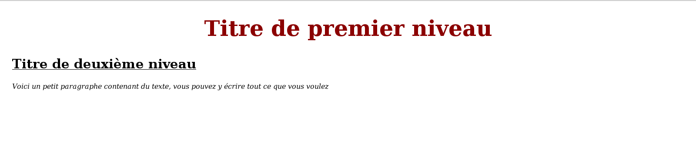

# Comment appliquer du CSS sur sa page web ?

## 1\.Deux méthodes obsolètes

**A\. Intégrer le CSS directement dans les balises HTML**

Disons le tout de suite, cette forme d'intégration du CSS dite en ligne est **très peu utilisée** et ce n'est pas comme ça que vous mettrez en forme votre site web. En effet, vos règles CSS ne s'appliquent alors qu'à une seule balise ce qui vous obligera à dupliquer votre code pour tous les éléments HTML concernés.

Voici l'exemple précédemment utilisé avec le css intégré en ligne grâce à l'attribut ```style```

```
<!DOCTYPE html>
<html>
<head>
  <title></title>
</head>
<body>
  <p style="font-size: 50px; background-color: blue;">Voici un premier paragraphe</p>
  <p style="font-size: 50px; background-color: blue;">Voici un deuxième paragraphe</p>
</body>
</html>

```

**B\. Dans l'en-tête de votre fichier HTML**

Une autre méthode **à éviter** est d'intégrer le CSS dans la balise ``` <head> ``` de votre fichier HTML grâce à la balise ``` <style> ```. Le problème est qu'il faudra dupliquer votre code CSS sur toutes vos pages HTML.

```
<!DOCTYPE html>
<html>
<head>
  <style>
    p {
    font-size: 50px;
    background-color: blue;
  }
  </style>
  <title></title>
</head>
<body>
  <p>Voici un premier paragraphe</p>
</body>
</html>

```
## 2\.Utiliser un fichier CSS

Il s'agit de la méthode la **plus commune et la plus efficace**, c'est celle que vous utiliserez pour intégrer du CSS à vos pages web. Elle consiste à écrire toutes les règles CSS dans un fichier séparé (nomé par convention style.css) et à inclure ce fichier dans la balise ``` <head> ``` de chacune de vos pages.

Cette méthode a plusieurs avantages :
- Elle permet de séparer code html et css et par conséquent de conserver un code clair.
- Elle évite de devoir se répéter et réécrire plusieurs fois le même code, ici un seul fichier s'applique à plusieurs pages et à plusieurs balises HTML.

L'inclusion de votre fichier CSS se fait au moyen de la balise ``` <link> ``` qui comporte deux attributs :
- rel : qui indique le type de fichier, dans notre cas "stylesheet"
- href : le chemin vers le fichier CSS à charger

Exemple de page html incluant une feuille de style

La page HTML :

```
<html>
  <head>
    <meta charset="utf-8">
    <title>Une page avec du css</title>
    <link rel="stylesheet" href="style.css">
  </head>
  <body>
    <h1>Titre de premier niveau</h1>
    <h2>Titre de deuxième niveau</h2>
    <p>Voici un petit paragraphe contenant du texte, vous pouvez y écrire tout ce que vous voulez</p>
  </body>
</html>

```

La feuille CSS style.css incluse dans le fichier HTML

```
h1 {
  font-size: 50px;
  text-align: center;
  color: darkred;
}

h2 {
  font-size : 30px;
  margin-left: 20px;
  text-decoration: underline;
}

p {
margin-left: 20px;
font-style: italic;
}

```

Vous pouvez copier ce code dans jsbin. Vous verrez alors que le titre principal est centré et rouge, le titre secondaire est souligné et le paragraphe est en italique.

 

## 3\.Sources

- https://openclassrooms.com/courses/apprenez-a-creer-votre-site-web-avec-html5-et-css3/mettre-en-place-le-css

- http://css.mammouthland.net/feuille-de-style-css-debutant.php#inline
