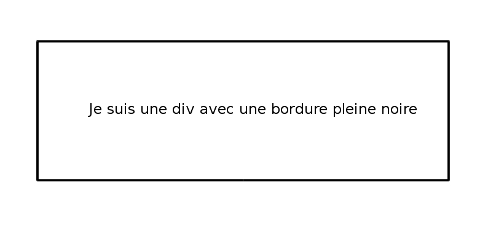

# Mise en forme avancée

Vous avez déjà réalisé votre première feuille de style ce qui est un premier pas dans le monde de l'intégration mais soyons honnête pour l'instant le résultat est un peu triste. Les éléments sont très linéaires, tout cela manque un peu de vie et de relief. Heureusement, petits chanceux que vous êtes, CSS vous permet d'aller beaucoup plus loin dans la mise en forme.

## 1\.Background

Ceci nous amène à une autre propriété essentielle de CSS, le background, qui nous permet de gérer le fond de nos éléments. On compte 5 propriétés background :

- **background-color** : comme cela a été expliqué cette propriété sert à modifier la couleur de fond d'un élément

- **background-image** : elle permet d'ajouter une image de fond à un élément, elle prend comme valeur : ```url("chemin d'image")```

- **background-repeat** : elle permet de gérer la répétition de l'image de fond qui par défaut se répète horizontalement et verticalement. Elle peut prendre comme valeur entre autres : ```repeat-x``` (répétition horizontale seulement), ```repeat-y``` (répétition verticale seulement) et ```no-repeat```.

- **background-position** : elle permet de définir la position de départ d'une image de fond. Elle peut se déterminer sémantiquement (left, right, center...) en pixels ou en %. Dans ces deux cas elle prend deux valeurs séparées par une virgule, la première est la position horizontale et la seconde verticale.

- **background-attachment** : elle détermine si l'image de fond est en position fixe ou si elle suit le scroll de l'écran. Elle prend logiquement deux valeurs "scroll" ou "fixed"

Pour connaître l'ensemble des valeurs disponibles pour les propriétés citées, vous pouvez consulter la documentation de MDN.

Un exemple de div contenant un cheval en image de fond (source Wikipédia), centré dans la div et sans répétition :

```
div {
  background-image: url("https://upload.wikimedia.org/wikipedia/commons/thumb/f/f7/Mangalarga_Marchador_Conforma%C3%A7%C3%A3o.jpg/290px-Mangalarga_Marchador_Conforma%C3%A7%C3%A3o.jpg");
  background-repeat: no-repeat;
  background-position: center;
}

```

## 2\.Bordures

Styliser nos backgrounds c'est bien mais les délimiter c'est mieux ! Pour ce faire, CSS nous permet de jouer sur les bordures de nos éléments avec ```border``` et ainsi de donner du relief à notre design. On compte trois propriétés principales pour border :

- **border-width** : permet de régler l'épaisseur de notre bordure en pixels

- **border-style** : définit le style de bordure (pleine, hachée, pointillés...)

- **border-color** : définit la couleur de la bordure

Vous pouvez, si vous le souhaitez, définir chaque propriété séparément mais aujourd'hui sachez que la bonne pratique consiste à utiliser la super propriété ```border``` qui permet de définir les trois à la suite. Ainsi au lieu d'écrire

```
div {
  border-width: 3px;
  border-color: black;
  border-style: solid;
}

```
Vous pouvez simplement écrire

```
div {
  border: 3px solid black;
}

```
Ce qui appliquera une bordure noire et pleine de 3 pixels d'épaisseur à vos div.



Notons également vous pouvez choisir de cibler un côté de la bordure en particulier, gauche, droit, haut ou bas en utilisant respectivement les propriétés :

- **border-left**

- **border-right**

- **border-top**

- **border-bottom**

## 3\.Ombres

Voici la dernière propriété de cet atelier sur la mise en forme avec CSS, la propriété shadow qui nous permet de gérer les ombres de nos éléments HTML.

Cet propriété est d'autant plus importante aujourd'hui que la tendance sur le web est au material design. Ce design consiste, entre autres, à donner de la profondeur à vos pages en donnant l'impression à vos visiteurs que les éléments sont sur différents plans. Cela se réalise notamment en jouant sur les ombres.

On compte deux propriété shadow :

- **text-shadow** : elle permet de gérer l'ombre d'un texte

- **box-shadow** : elle permet de gérer l'ombre d'un conteneur

Chacune de ces propriétés prend plusieurs valeurs :

- la **portée horizontale** de l'ombre en pixels

- la **portée verticale** de l'ombre en pixels

- le **dégradé** de l'ombre en pixels

- la **taille** de l'ombre en pixels

- la **couleur** de l'ombre (souvenez-vous des différentes notations pour les couleurs)

- éventuellement on peut spécifier l'ombre comme étant à l'intérieur de l'élément avec ```inset```

Toutes les valeurs citées ci-dessus ne sont pas nécessaires, vous pouvez très bien vous contenter d'utiliser les deux premières, cependant il est important de respecter leur ordre.

Concrètement si je veux appliquer une ombre grise orientée vers le bas et la droite et légèrement dégradée sur toutes mes div je peux écrire :

```
div {
  box-shadow: 3px 2px 5px 4px grey;
}

```


Gardez à l'esprit que les ombres sont difficiles à maîtriser en CSS, réussir à faire de belles ombres qui mettent en avant de manière moderne vos éléments HTML vous prendra du temps.

Si vous le souhaitez vous pouvez vous entraîner et voir le résultat de différentes ombres à cette adresse http://www.debray-jerome.fr/outils/Generateur-de-box-shadow-css3.html

## 4\.Sources

- https://openclassrooms.com/courses/apprenez-a-creer-votre-site-web-avec-html5-et-css3/la-couleur-et-le-fond

- http://stylescss.free.fr/couleurs.php

- https://openclassrooms.com/courses/apprenez-a-creer-votre-site-web-avec-html5-et-css3/les-bordures-et-les-ombres

- http://css.mammouthland.net/border-css.php

- http://www.alsacreations.com/tuto/lire/910-creer-des-ombrages-ombres-css-box-shadow-text-shadow.html
