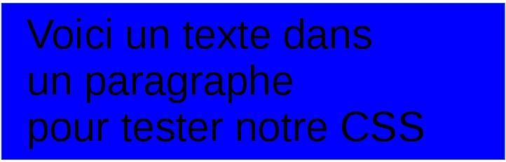

# Le CSS en quelques mots

## 1\.Le CSS à quoi ça sert ?

Le CCS pour Cascading Style Sheets (Feuilles de style en cascade) est un langage web de description qui comme son nom l'indique permet d'appliquer des feuilles de style aux pages web. Une feuille de style est un ensemble de **règles** qui vont cibler les éléments HTML de votre page et leur appliquer une **mise en forme**.

Concrètement, si le HTML est le corps de votre page, alors on peut dire que le CSS correspond aux vêtements. **Il vient habiller le contenu** et permet de créer des sites professionnels comme ceux à cette adresse : http://www.csszengarden.com/. Dans la colonne de gauche vous trouverez des exemples de sites design et moderne où le CSS joue un rôle clef.

Avec le CSS vous pouvez gérer par exemple:

- Les polices (types, taille, styles...)

- Les couleurs

- La position de vos éléments sur la page

- Les ombres

- Les tailles

- Et bien plus encore !

## 2\.Le CSS syntaxe de base

Voilà pour la théorie mais concrètement du CSS à quoi ça ressemble ? Voici un petit exemple très simple.

Code HTML à mettre en forme :

```
<!DOCTYPE html>
<html>
<head>
  <meta charset="utf-8">
  <meta name="viewport" content="width=device-width">
  <title></title>
</head>
<body>
  <p>Voici un texte dans un paragraphe pour tester notre CSS</p>
</body>
</html>

```
Code CSS permettant de mettre en forme le HTML

```
p {
  font-size: 30px;
  background-color: blue;
}

```

Nous reviendrons plus en détails sur la syntaxe mais à votre avis qu'avons indiqué avec cette règle CSS ? Nous venons en fait de sélectionner tous les paragraphes de notre document avec le "p" puis entre les accolades nous avons assigné une taille de 50 px à la police et un fond bleu.

Allez sur https://jsbin.com/mohaquhuni/edit?html,css,output et insérez le code si vous souhaitez essayer de le modifier. Voici le résultat :


