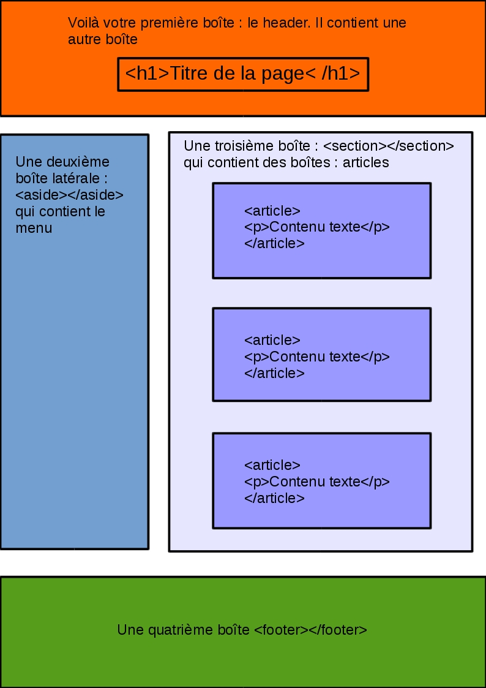
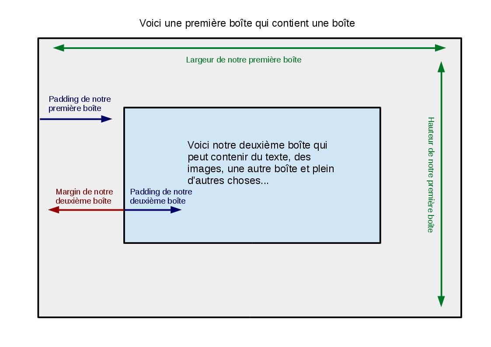

# Le modèle de boîte

https://skillcode.fr/le-box-model/

Pour organiser ses pages avec CSS il est important de comprendre le concept essentiel qu'est le modèle de boîte ou box model en anglais. En CSS tous les éléments HTML sont considérés comme des **boîtes qui peuvent contenir ou être contenues dans d'autres boîtes**.

Visuellement vous devez donc penser vos pages comme un ensemble de carrés et de rectangles qui peuvent s'imbriquer les uns dans les autres.



Bien évidemment il y a tout un ensemble de propriétés qui découlent de ce box model.

**1\.Taille physique des boîtes**

Ces boîtes sont définies par deux propriétés fondamentales :

- **width** : elle définit la largeur de l'élément  en pixels ou en % de son container

- **height** : elle définit la hauteur de l'élément en pixels ou en % de son container

En effet une boîte, comme une div par exemple, n'a pas de taille prédéfinie si elle ne contient aucun élément. C'est à vous de déterminer sa taille. En plus des propriétés width et height on notera aussi deux propriétés voisines :

- **max-width/min-width** : elle permet de déterminer la largeur maximale/minimale de l'élément

- **max-height/min-height** : elle permet de déterminer la hauteur maximale/minimale de l'élément

Bien souvent pour faire un design responsive qui s'adapte à différents appareils, vous indiquerez la taille de vos éléments en % et spécifierez une taille maximale ou minimale en pixels.

Par exemple ici j'aurai toujours une div en forme de carré qui fera 20% de l'élément/boîte qui la contient (on parle de l'élément parent) tant que cette taille ne dépasse pas 200px :

```
div {
  width: 20%;
  height: 20%;
  max-width: 200px;
  max-height: 200px;
}

```
**2\.Les marges**

La marge en CSS est la **distance qui sépare une boîte d'une autre**, on distingue deux types de marges :

- **margin** : c'est la marge extérieure de la boîte, celle qui la sépare de sa boîte parent en pixels, en pourcentages ou en em

- **padding** : c'est la marge interne de la boîte, celle qui la sépare de la boîte qu'elle contient (boîte enfant) en pixels, en pourcentages ou en em

On peut spécifier la marge ou le padding left, top, right ou bottom grâce aux propriétés telles que ```margin-top``` par exemple. Quand cela est possible on préférera utiliser les propriétés globales margin et padding.

Par exemple j'applique ici à ma div une marge interne et externe de 2em sur ses 4 côtés

```
div {
  margin: 2em;
  padding: 2em;
}

```
Ou je peux spécifier des valeurs différentes selon les côtés, l'ordre est toujours le même : top, right, bottom et left. Si vous ne spécifiez que deux valeurs la première vaudra pour la marge top/bottom et la seconde right/left

```
div {
  margin: 1em 2em 1.5em 2.5em;
  padding: 1em 2em;
}

```
NB : Si vous souhaitez placer un élément au centre de son container vous pouvez également utiliser la valeur "auto" pour margin.

**3\.Le modèle de boîte résumé**

Voici un schéma récapitulatif pour vous représenter ce modèle de boîte qui encore une fois est fondamental en CSS.



## 2\.Exercices

## 3\.Sources

- https://developer.mozilla.org/fr/Apprendre/CSS/Les_bases/Le_mod%C3%A8le_de_bo%C3%AEte

- https://openclassrooms.com/courses/apprenez-a-creer-votre-site-web-avec-html5-et-css3/le-modele-des-boites

- https://openclassrooms.com/courses/apprenez-a-creer-votre-site-web-avec-html5-et-css3/le-positionnement-en-css
