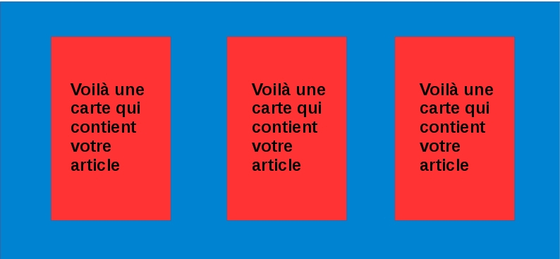
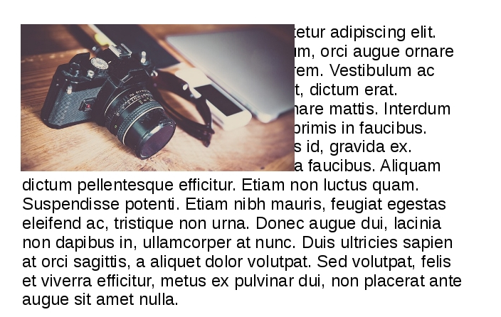

# Le positionnement

https://skillcode.fr/le-positionnement-en-css/

Vous avez dû le remarquer pour l'instant la plupart de vos éléments viennent se mettre les uns à la suite des autres ce qui est un peu triste.

CSS vous permet de positionner vos éléments où vous le souhaitez sur votre page pour peu que vous maîtrisiez quelques notions. **Il existe de nombreuses manières de gérer le positionnement en CSS**, dans cette partie nous aborderons la méthode classique, plus tard vous verrez qu'il en existe d'autres.

Bien évidemment les notions vues précédemment (taille des éléments et marges) vont également jouer un rôle dans la position de vos éléments. Il faudra donc les prendre en compte, ce n'est pas pour rien que nous en avons parlé juste avant !

## 1\.Nature des éléments

Avant toute chose, pour bien comprendre le positionnement, il faut savoir que les balise HTML peuvent être principalement de deux natures différentes qui influencent leur position sur la page :

- **block** : les éléments de type block (header, footer, nav, div, p, h1 et bien d'autres) viennent se placer **en dessous** des autres les uns à la suite. Ils ne se mettront jamais naturellement sur la même ligne. **On peut modifier leurs propriétés physiques** (width/height).

- **inline** : les éléments de type inline (a, span...) viennent quant à eux se placer les uns **à la suite des autres** sur la même ligne tant qu'il y a de la place. **On ne peut pas modifier leurs propriétés physiques**.

## 2\.Display des éléments

Super vous comprenez maintenant comment vos balises HTML se comportent ! Mais en quoi cela vous aide à positionner vos éléments ? Tout cela a l'air un peu figé non ? Heureusement CSS nous offre la propriété ```display``` qui permet de modifier la nature des éléments HTML.

Display prend plusieurs valeurs :

- **inline** (voir ci-dessus)

- **block** (voir ci-dessus)

- **inline-block** : voilà une propriété très intéressante, elle permet de placer vos éléments de type block sur une même ligne tout en conservant la possibilité de modifier leur taille et marges. C'est probablement **l'une des valeurs que vous utiliserez le plus**. Il vous incombera ensuite d'utiliser le margin et padding pour finir votre positionnement avec précision.

- **none** : permet de cacher un élément sur la page sans que celui-ci influence les autres

Ainsi si je veux obtenir des cartes en ligne qui contiendraient chacune un article dans un blog je peux utiliser la propriété display de la manière suivante :

```
<!DOCTYPE html>
<html>
<head>
  <meta charset="utf-8">
  <title>Des divs en ligne</title>
</head>
<body>
  <section class="container">
    <article class="element"></article>
    <article class="element"></article>
    <article class="element"></article>
  </section>
</body>
</html>

```

```
.container {
  width: 100%;
  height: 200px;
  background-color: skyblue;
}

.element {
  width: 60px;
  height: 80px;
  background-color: red;
  margin: 2.5em;
  display: inline-block;
}

```
Voilà le rendu obtenu :



Naturellement vos éléments ```inline-block``` iront se placer au bas de leur contenair sur l'axe vertical (on parle de baseline). Vous pouvez régler leur position grâce à la proriété ```vertical-align```. Elle peut prendre différentes valeurs, entre autres :

- **top** : haut

- **middle** : milieu

- **bottom** : bas

## 3\.Les éléments flottants

Vous avez déjà probablement remarqué sur des sites web des images entourées par du texte un peu comme ici



En CSS l'image sur la photo a la propriété ```float```. Elle peut prendre deux valeurs :

- **left**

- **right**

Exemple pour l'image en question :

```
img {
  float: left;
}

```

La propriété float a pour effet de **"coller"** l'élément sur le côté spécifié de son container ou de l'écran (droit ou gauche). La balise ainsi visée entraîne également avec elle toutes celles qui la suivent dans le code HTML et ceux-ci viennent l'entourer comme le texte sur la photo. L'exemple donné constitue aujourd'hui l'un des principaux usages de la propriété float.

NB : Il est possible d'empêcher les éléments qui suivent de venir wrapper la balise avec la propriété float. Pour cela il suffit de leur ajouter la propriété "clear" qui prend pour valeur left, right ou both selon la valeur de float.

Sur la photo si je voulais empêcher le texte de venir autour de l'image je pourrais écrire :

```
p {
  clear: left;
}

```

## 4\.Sources

- https://developer.mozilla.org/fr/Apprendre/CSS/Les_bases/Le_mod%C3%A8le_de_bo%C3%AEte

- https://openclassrooms.com/courses/apprenez-a-creer-votre-site-web-avec-html5-et-css3/le-modele-des-boites

- https://openclassrooms.com/courses/apprenez-a-creer-votre-site-web-avec-html5-et-css3/le-positionnement-en-css
