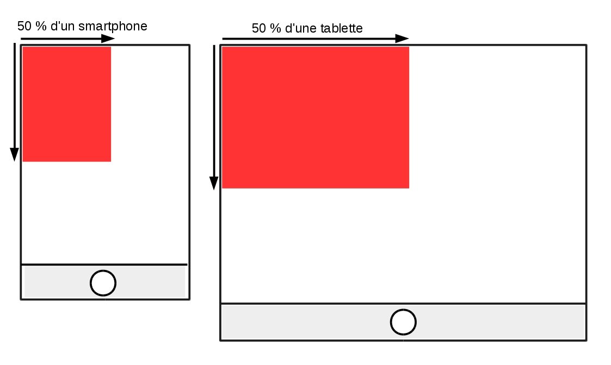

# Aperçu détaillé des différentes unités de mesure en CSS

Voilà le moment est venu d'aborder dans ce dernier chapitre un sujet incontournable en CSS : les unités et leurs comportements. Pour les valeurs numériques, nous pouvons utiliser plusieurs unités, nous avons déjà vu les pixels, les pourcentages et les em. Sachez qu'il en existe bien d'autres et nous en verrons une quatrième ensemble : les REM.

Pour bien comprendre l'importance des différentes unités il faut les séparer en deux groupes distincts :

- les **unités absolues** (pixels) : une unité dite absolue aura un **rendu fixe** à l'écran peut importe la taille de celui-ci, la taille physique de l'élément perçue par l'internaute ne changera donc jamais.

- les **unités relatives** (%, em, rem) : une unité dite relative aura un **rendu variable** car elle est calculée par rapport à la taille de son élément parent et par défaut la taille de l'écran.

La différence entre unités absolues et relatives prend toute son importance dans la réalisation de designs responsives.

Qu'est ce qu'un **design responsive** ? Il s'agit d'un design de site qui **s'adapte au format de l'appareil des visiteurs**. Aujourd'hui nous naviguons de plus en plus sur smartphones et tablettes, cependant un écran de smartphone et un écran d'ordinateur 17 pouces n'offrent pas le même espace pour afficher du contenu. Un design responsive c'est donc un design qui reste cohérent et ergonomique peu importe la taille de l'appareil de lecture. Pour réaliser un tel exploit il va falloir jongler entre les unités absolues et relatives.

## 1\.Pixels

Il s'agit de l'unité absolue la plus simple en CSS, elle correspond tout simplement à **un point sur l'écran**. L'avantage principal des pixels et d'offrir une très grande précision dans la définition des tailles, des marges et des polices.

On pourrait donc être tenté de n'utiliser que des mesures en pixels mais il faudrait alors les redéfinir pour chaque taille d'écran car un pixel fera toujours la même taille que l'on soit sur ordinateur ou smartphone. Prenons l'exemple suivant :

```
div {
  width: 500px;
  height: 300px;
}

```

Vous obtenez une div de 500 pixels de large (environ 13cm), cette div passera très bien sur un écran d'ordinateur ou sur une tablette, par contre elle sortira de l'écran sur un smartphone et l'utilisateur devra scroller.

Comme expliqué au chapitre précédent nous utiliserons donc les pixels pour stipuler des **tailles minimales et maximales**. Autrement-dit des tailles fixes que nos éléments HTML ne pourront jamais dépasser.

## 2\.Pourcentages

Les pourcentages sont principalement utilisés pour indiquer des **tailles d'éléments ou des marges**, l'avantage est que cette taille est relative à la taille de son container.

Si je donne une taille de 20% à une div, je sais qu'elle fera toujours 20% de mon écran  ou de son élément parent que je sois sur smartphone, tablette ou ordinateur. On utilisera donc en priorité les pourcentages pour déterminer la taille et les marges de nos éléments, cela nous assurera de **conserver des proportions cohérentes** peu importe la taille de l'écran. Par exemple, dans le cas présent ma div fera toujours 1/4 de mon écran :

```
div {
  width: 50%;
  height: 50%;
}

```


NB : il se peut que nous n'arriviez pas à spécifier une hauteur en %, si c'est le cas, souvenez-vous que **la taille est définie par rapport à l'élément parent**. Cela veut dire que le parent n'a pas de hauteur fixe, il faut donc la définir en px ou %. Votre parent peut être votre ```body``` ou même votre document HTML :

```
html {
  height: 100%;
}

```

## 3\.EM

Les "em" sont une unité principalement utilisée pour **définir la taille des polices et des marges**. Il s'agit là encore d'une unité relative, la taille d'un em est relative à la taille de police de l'élément parent.

Autrement-dit 3 em vaut trois fois la taille de l'élément parent. De base, **si aucune taille de police n'a été spécifiée, 1 em vaut la taille de police par défaut du navigateur**, soit 16px la plupart du temps. Libre ensuite à nous de modifier cette taille.

Par exemple : je définis la taille de police à 3em dans une div, mon texte fera 48px de haut. Si ensuite dans une div enfant je redéfinis la taille de police à 3em mon texte fera 3*48px de haut soit 144px.

```
<div id="firstdiv">
  <p>test</p>
  <div id="seconddiv">
    <p>test</p>
   </div>
 </div>

```

```
#firstdiv {
  background-color: red;
  font-size: 3em;
}

#seconddiv {
  font-size: 3em;
}

```


Le problème avec les em est que **toute modification de taille de police sur un élément parent entraîne la modification de ses enfants** et la gestion de vos polices peut vite devenir complexe.

## 4\.REM

Les REM (pour root em) sont en fait très semblables aux em à la seule différence prêt que **les rem sont relatifs à la taille de l'élément racine de la page**, c'est à dire le document HTML en lui-même.

Autrement-dit 1rem vaut 16px dans la plupart des cas, peut importe la taille de police de l'élément parent. En utilisant les rem vous évitez donc les mauvaises surprises que vous pouvez avoir avec les em.

Les rem possèdent également un dernier avantage, vous pouvez redéfinir toutes les proportions de vos polices selon la taille de l'écran en changeant simplement la taille de la police par défaut.

Par exemple, je peux la diviser par deux :

```
html {
  font-size: 8px;
}

```

## 5\.Sources

- http://www.w3schools.com/cssref/css_units.asp

- http://connect.adfab.fr/developpement-front/unite-de-mesure-css-rem
