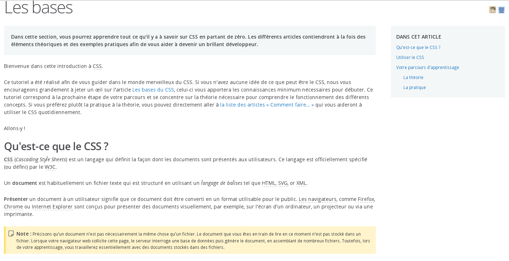
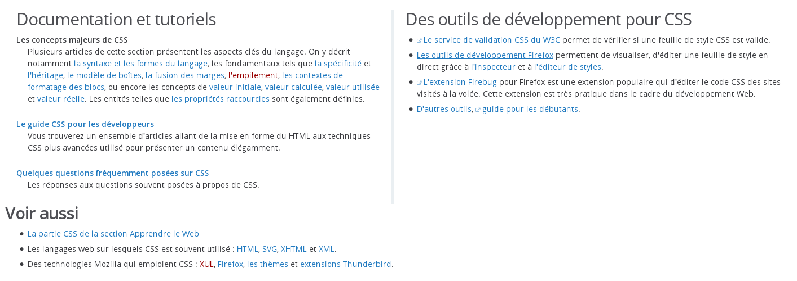

# Mozilla Developer Network : une ressource clef

Pour tous les langages, la documentation est essentielle. Une documentation bien utilisée vous permettra de produire un code efficace et de qualité. Comme dans le cas du langage HTML la fondation Mozilla met à votre disposition un **ensemble de ressources documentaires** qui constitueront votre bible de développeur CSS.

Pour y accéder rendez-vous à cette adresse : https://developer.mozilla.org/fr/docs/Web/CSS Vous y trouverez 3 sections majeures.

## 1\.Une référence ou glossaire du CSS

Concrètement de quoi s'agit-il ? Comme tout langage le CSS a sa propre syntaxe et son propre vocabulaire. On parle par exemple de propriétés, ces propriétés sont nombreuses et **vous ne les retiendrez pas toutes**.

En vous rendant  à cette adresse https://developer.mozilla.org/fr/docs/Web/CSS/Reference vous trouverez donc une description complète (syntaxe, règles, effets) de tous les éléments CSS qui vous permettront d'écrire vos premières règles. **A consulter en priorité quand vous avez une question** !

## 2\.Un tutoriel

Si jamais les ressources à disposition ne vous suffisent pas ou que vous souhaitez revenir sur un aspect du CSS que vous n'avez pas compris, MDN vous propose un tutoriel complet qui vous permettra de vous familiariser pas à pas avec le CSS.

Vous pourrez le trouver à cette adresse : https://developer.mozilla.org/fr/Apprendre/CSS . Dans la section Les bases, vous trouverez 4 sous-sections avec des articles qui reviennent sur les grands concepts du CSS.

## 3\.Des listes récapitulatives

Très brièvement, sur https://developer.mozilla.org/fr/docs/Web/CSS vous trouverez deux listes

- "Documentation et tutoriel" : une liste des principaux articles cités ci-dessus

- "Des outils de développement pour CSS" : une listes des principaux outils qui vous aideront dans vos développements (extensions de navigateur, débuggers...)

